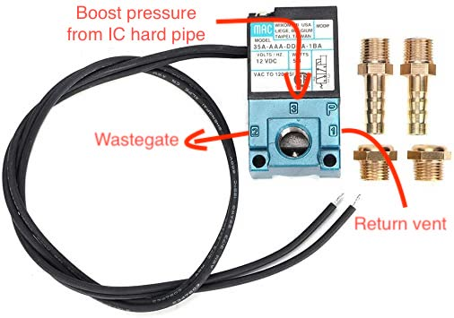
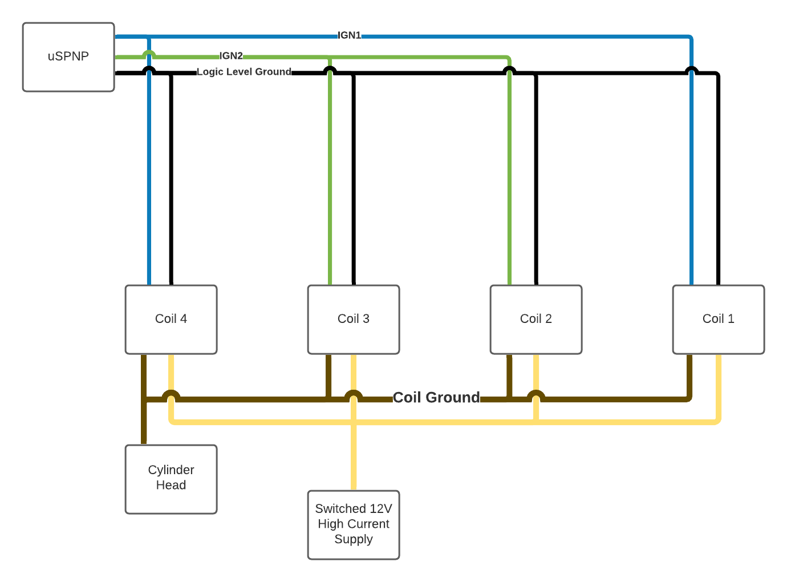

# Installation Requirements

## Required Components

The following items are required to complete installation

*   uSPNP Unit
*   USB-serial adapter cable
    *   FTDI-FT232RL Chipset recommended
    *   Drivers: [https://www.ftdichip.com/Drivers/VCP.htm](https://www.ftdichip.com/Drivers/VCP.htm)
*   Crank Angle Sensor
    *   GS100502
    *   This sensor is a hall effect sensor with a VccMAX of 15VDC
*   Crank Angle Sensor Setup
    *   Crank Angle Sensor Bracket
    *   36-1 or 60-2 Trigger wheel
        *   Clewett Engineering builds a kit, do not purchase the sensor from clewett it is untested with the uSPNP
    *   DIY is an option, a DXF file for waterjet cutting a trigger ring which can be welded to the crank pulley can be provided
*   MAP Sensor
    *   Delphi PS10081 (3 bar GM)
*   MAP Sensor Pigtail
    *   Make sure you purchase a connector with the correct pin keying for the 3 bar sensor
    *   4mm diameter silicone vacuum line
    *   3 way brass fitting to suit silicone line
*   High Impedance Injectors
    *   Factory injectors will cause your uSPNP to overheat and fail
    *   80# seimens deka injectors are a good fit and will work with the provided base tune on the standard 2.5bar fuel regulator

## Optional Components

These components are recommended for a complete installation

*   GM IAT
    *   Part numbers:
        *   25036751 or 25037334
    *   You can technically use the sensor in the factory AFM (this is not recommended)
*   Wideband O2 Controller
    *   Spartan Lambda Controller 2 w/LSU 4.9 by 14point7 is recommended
*   Boost control valve
    *   MAC 3 or 4 port valve
    *   4 port may allow for faster spool with the right wastegate setup
    *   Part numbers:
        *   3 port: 35A-AAA-DDBA-1BA
        *   4 port: 46A-AA1-JDBA-1BA

# Basic Installation

Basic installation will allow you to test communication with the ECU, and verify some functionality.

1. Unplug the DME 35-pin connector from your existing ECU
2. Connect the 35-pin connector to your uSPNP
3. Connect your serial-USB cable to the ECU and to your computer
4. Do not connect extra sensors harness

## Verify Basic Functionality

*WARNING: Verification of functionality will run the fuel pump, your fuel system should be checked for leaks before applying power to the uSPNP. You may also need to leave the ignition switch in position 2 for some time, be aware of battery discharge. If you have already installed a wideband oxygen sensor, you may wish to disable the sensor heater while performing the installation/verification to avoid sensor damage.*

1. Turn the ignition to position 2
    1. You should hear the fuel pump prime for 3 seconds
2. Open tuner studio, load the project file supplied
3. Setup serial communication
    1. Go to Communications menu -> Settings
    2. Select connection type RS232 Serial Interface
    3. Press the detect button and select your ECU
    4. Press Accept

You should now see the dashboard showing a stable coolant temperature. Some other sensors may currently be showing unusual values or be increasing continuously. This is normal as these sensors are not yet connected.

## Output Test Procedure

*WARNING: Test mode may put outputs into unusual states, if you have already connected your coil packs they may begin uncontrolled dwell when test mode is enabled and may be damaged.*

1. Click “CAN bus/Testmodes” in the top right
2. Click “Output Test Mode - I/O”
3. Click “Enable Test Mode”
4. Click “On” under fuel pump, your fuel pump should switch on
    1. You may also test tachometer by clicking “pulsed” under tachometer
5. Click “Off” and “Disable Test Mode”
6. Turn off the ignition

# Extra Sensors Harness

| #    | Name    | Color  | Bundle             | Description                                                  |
| ---- | ------- | ------ | ------------------ | :----------------------------------------------------------- |
| 1    | 12V     | Orange | Crank Angle Sensor | Vcc (12V) for crank angle sensor                             |
| 2    | IGN1    | Blue   | Ignition           | Logic level signal (5V) for coil packs cyl 1 and 4           |
| 3    | VREFGND | Black  | Ignition           | Logic level ground for coil packs                            |
| 4    | VREFGND | Black  | MAP                | Ground for MAP sensor                                        |
| 5    | OPTOIN+ | Black  | Crank Angle Sensor | Signal from crank angle sensor                               |
| 6    | MAP     | White  | MAP                | Signal from MAP sensor                                       |
| 7    | VREF    | Red    | MAP                | Vcc (5V) for MAP sensor                                      |
| 8    | LAUNCH  |        |                    | Unused, Opto-isolated input, can be supplied 5-12V to signal the ECU on the LAUNCH input |
| 9    | BOOST   | Orange | KLR                | Grounding output for boost control valve High current capable |
| 10   | PT6_HC  |        |                    | Unused, Grounding output High current capable           |
| 11   | GND     | Purple | Crank Angle Sensor | Ground for crank angle sensor                                |
| 12   | GND     |        |                    | Unused                                                       |
| 13   | 12V     |        |                    | Unused                                                       |
| 14   | IGN2    | Green  | Ignition           | Logic level signal (5V) for coil packs cyl 2 and 3           |
| 15   | VREFGND | Blue   | Wideband O2        | Ground reference for wideband O2 controller (may not be required for all controllers) |
| 16   | VREFGND | Blue   | KLR                | TPS Ground                                                   |
| 17   | O2      | White  | Wideband O2        | Wideband O2 linear/analog input (0-5v)                       |
| 18   | TPS     | Green  | KLR                | TPS signal                                                   |
| 19   | VREF    | Red    | KLR                | Vcc (5V) for TPS                                             |
| 20   | VREF    |        |                    | Unused                                                       |
| 21   | VREFGND |        |                    | Unused                                                       |
| 22   | KNOCK   |        |                    | Unused, Opto-isolated input, can be supplied 5-12V to signal the ECU on the KNOCK input |
| 23   | GND     |        |                    | Unused                                                       |
| 24   | GND     |        |                    | Unused                                                       |

The extra sensors harness is divided into bundles. Each bundle is either routed to the same destination or is concerned with a single sensor/function. Not all pin locations have wires in them, they can be added later if additional functionality is desired.

# MAP Sensor Installation

**Harness Bundle Info: [MAP] black (4), white (6), red (7)**

The MAP sensor will be installed in the passenger footwell where the computers are. It can be installed in the engine bay but will require wiring harness extension. There is a manifold pressure line already in this area heading to the KLR. Use some silicone hose (4mm ID) and a T-shaped barb to split off a pressure line for the MAP sensor. The KLR should still have a connection to this line if you want to keep the factory boost gauge functional, if you don't want to keep the factory boost gauge then there is no need to tee the line.

Identify the MAP sensor bundle in the extra sensors harness, solder to the pigtail you have purchased to connect your map sensor.

Red is 5V, Black is ground, White is sensor signal. Cross reference with the documentation for the MAP sensor you purchased.

GM 3 bar pinout shown here, in this case connect:

- black (4) -> A
- white (6) -> B
- red (7) -> C

# TPS and Boost Control Connection

**Harness Bundle Info: [KLR] orange (9), black (16), green (18), red (19)**

On the 944 turbo the TPS signal goes to the KLR and not to the DME, the KLR also controls the factory cycling valve for boost control. In order to use the TPS signal and control boost these signals must be cut from the KLR loom. The KLR loom is quite long pull it out to a comfortable working location and peel off some of the insulating tape.

Find the following 4 wires:

- white w/dark blue stripe
- white w/green stripe
- white w/red stripe
- blue w/red stripe

Generally the TPS wires (white with colored stripes) are located close together in the loom. Cut all 4 of these wires, leave yourself some wire length on the KLR side in case you make a mistake or want to reconnect these later. Individually tape off or heatshrink the ends of these wires on the KLR connector side of the loom so they don't ground out on anything. The KLR will still be providing 5V on the TPS sensor wires so make sure to safely tape this off. 

From the KLR bundle in the extra sensors harness solder the wires to the engine side of the KLR loom accordingly:

| ECU Extra Sensors Harness Color | KLR Wire Color       | Purpose                                                     |
| ------------------------------- | -------------------- | ----------------------------------------------------------- |
| Orange (9)                      | Blue w/red (2)       | Boost Control grounding output "Timing valve (output)" |
| Black (16)                      | White w/dark blue    | VREFGND/TPS Ground "Angle sensor - ground"             |
| Green (18)                      | White w/green stripe | TPS Signal "Angle sensor - tap"                        |
| Red (19)                        | White w/red          | VREF/Vcc (5V) for TPS "Angle sensor - supply"          |

## Boost Valve Installation

The factory cycling valve is useless when used with any aftermarket ECU or with an aftermarket wastegate.

### Background

The cycling valve either allows (default) or blocks (when energized) boost pressure across connections C->W to the wastegate. Allowing by default means that if the KLR does nothing then the boost pressure will open the wastegate at wastegate spring pressure (factory spring pressure is about 4psi). This is limp mode or what happens when KLR over-pressure boost cut is hit.

When the cycling valve is energized by the KLR it is blocking flow C->W this prevents the wastegate from opening until exhaust gas pressure on the valve seat is enough to overcome the spring, on my car this was about 12psi. While blocking C->W, air is allowed to flow W<->R, making sure the wastegate is still able to open and close freely as the air inside the wastegate manifold needs to go somewhere as it moves. This small amount of air is vented to and from the J-boot.

This control valve setup is exactly what the uSPNP will use, just the cycling valve itself is being replaced for a more modern version.

### Installation

1. Remove the electrical connector from the top of the factory cycling valve
2. Cut off the connector, leave 3-4cm of wire attached to this connector so you can re-use it later if desired
3. Crimp or solder the replacement MAC valve to the wires you cut from the factory cycling valve. Polarity does not matter for solenoid valves.
4. Connect the rubber pressure lines according to the following diagram. You may choose to run a new line from the IC hard pipe banjo fitting directly or cut off the factory clamps (for lines R and C) and install new lines from the vacuum distribution tree. 
   You can remove the factory cycling valve.

If you're using a dual port TiAL wastegate, the line from port 3 on the MAC valve probably connects to the lower fitting on the wastegate body (the one that makes the valve open). You should check all documentation to verify this is exactly correct for your setup.

The return vent line isn't strictly required and can be just left disconnected if you like. Normally this would introduce a small amount of un-metered air to the j-boot, but this isn't a big issue for MAP based systems. Remove and block to prevent dirt from entering your fancy turbo.

# Crank Angle Sensor Setup

**Harness Bundle Info: [Crank Angle Sensor] Orange (1), Black (5), Purple (11)**

*WARNING: The correct opto pull-up resistor and supply voltage must be chosen for the specific model of hall effect sensor you've purchased. The ECU is setup specifically for hall effect sensor model GS100502. VR sensors are not supported*

Pass the crank angle sensor harness bundle through the firewall into the engine bay. Route the harness to the correct location and cut to length. Crimp a 3-pin waterproof connector onto the harness and your hall sensor connecting as follows:

| Harness         | Sensor            | Purpose/Description       |
| --------------- | ----------------- | ------------------------- |
| Orange (12V)    | Brown (Vcc)       | Supply voltage            |
| Black (OPTOIN+) | Black (OUTPUT V0) | Crank angle sensor signal |
| Purple (Ground) | Blue (Ground)     | Ground                    |

# Ignition/Coil Pack Setup

If you're running the factory coilpack and distributor then you're all done, no further changes are required.

**Harness Bundle Info: [Ignition] blue (2), black (3), green (14)** 

*WARNING: The microsquirt module (underlying ECU module) provides 2 **logic level** ignition outputs. This means they can only drive "smart" coils. If a "dumb" coil connected the ECU will be destroyed immediately. You may use external logic level igniter modules to make dumb coils smarter. The ground provided in the harness ignition bundle is only to ground the logic level signal, grounding the coil itself through this connection will likely also result in damage to the ECU.*

The microsquirt module has 2 logic level ignition outputs, with some firmware changes you can expose WLED and ALED as logic level ignition outputs also to have a total of 4 if desired, this is out of scope for this installation. With just 2 ignition outputs and 4 cylinders the system must be wired to use wasted spark i.e. each coil pack will fire on both the power stroke and the exhaust stroke (wasted). In this configuration the ECU doesn't actually know if the cylinder is on power or exhaust stroke (and it doesn't need to); therefore no camshaft angle sensor/trigger is required.

Run the ignition harness through the firewall, poking a hole in the existing loom rubber grommet is possible but you risk damaging the wires if you aren't extremely careful.

You'll likely need to make a small loom to match the above wiring setup required for your coilpacks. Split the IGN1 signal to coils 1 and 4, and IGN2 to coils 2 and 3. Logic level ground can be shared between all coil packs.

The factory coil has a switched 12V high current power supply available in the engine bay that can be used. A solid coil ground absolutely essential for a correctly working coilpack setup, this can be a shared location for all 4 coilpacks but individual coil grounds is okay too.

# ECU Configuration

During installation there are a few variables you need to set in the ECU.

Turn on the ignition to position 2 in the car, make sure the coil packs are not getting hot. If the coil packs get hot or start firing, turn off the ignition, disconnect the extra sensors harness, turn the ignition back to position 2, connect to the ECU in tuner studio, check "Spark Output" is set to "Going High" under Ignition Settings -> Ignition Options.

All below processes should be done with the ECU powered and connected

## Ignition Setup

- Go to Ignition Settings -> Ignition Options

- If you have used coil packs in wasted spark configuration as above, from the option "Number of coils" choose "Wasted spark". If you're using the factory coil set this to "Single coil"

- When you installed the 36-1 or 60-2 trigger wheel on the crank you should have been able to determine the "Tooth #1 Angle(deg BTDC)" enter this accordingly, see the below diagram for clarification.

- Set dwell times according to manufacturer spec for your coil

- Burn changes

  

  

## Fueling Setup

- Go to Fuel Settings -> Injector dead time, setup as per manufacturer specs and burn changes
- Go to Basic/Load Settings -> Engine and Sequential Settings, set injector size (in cc), burn changes

## Verify sensors and calibrations

Follow all instructions in section 2.11 and 2.12 in the msextra manual

http://www.msextra.com/doc/pdf/html/Megasquirt2_Setting_Up-3.4.pdf/Megasquirt2_Setting_Up-3.4.html

# Wideband O2 controller connection

**Harness Bundle Info: [Wideband O2] blue (15), white (17)**

*WARNING: Do not ground the wideband heater through the ECU this could cause damage or sensor reading fluctuations*

The blue wire is a reference ground, some controllers want a reference ground or "electronics ground", not to be confused with the heater ground. If the controller only has one ground then this should not be connected to the ECU. 

The white wire should be connected to the wideband controller linear/analog output. The controller will be outputing a voltage signal between 0V and 5V representing the AFR reading. This requires calibration in tuner studio so the ECU and the controler can agree on what 0V and 5V actually mean in terms of AFR. Follow the calibration instructions for your controller.

## Start the Car

If everything is wired correctly, you should now be able to start the car.

